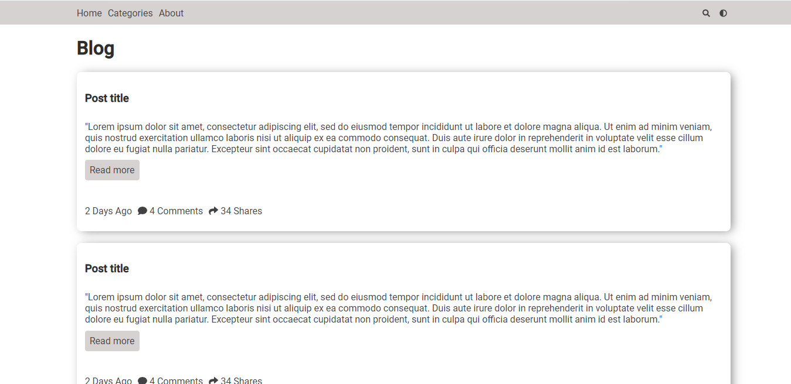

  <h1> Blog template </h1>

---

## índice

- [Sobre](#about)
- [Como usar](#howToUse)

## Sobre

Página web simples usada como exemplo no artigo [Como fazer dark theme com JavaScript puro](https://medium.com/david-fernando/como-dark-theme-com-javascript-puro-fc277377447c)

## Como usar
Está aplicação não necessita de um servidor local. 
Você pode abri-la apenas clicando no index.html, ou se ainda preferir pode abrir no localhost.

## Autor

[@david-fernando](https://github.com/david-fernando)
